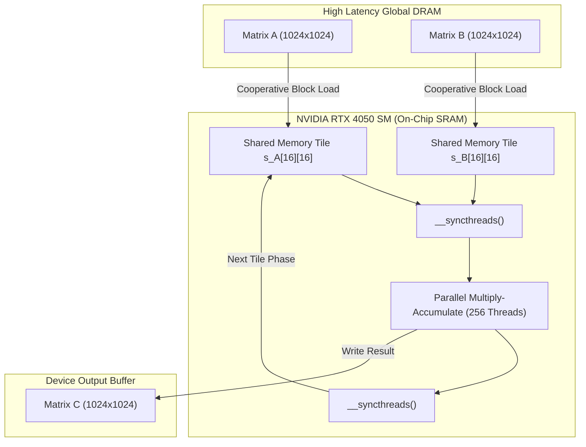

# Heterogeneous Matrix Multiplication Benchmark: CPU vs. GPU Performance Analysis Report

**Project**: Unified CPU-GPU Matrix Multiplication Benchmark  
**Author / Engineering Context**: High-Performance Computing (HPC) & Heterogeneous Architecture Evaluation  
**Target Hardware**: 13th Gen Intel Core i7-13650HX (CPU) & NVIDIA GeForce RTX 4050 Laptop GPU  
**Platform**: Ubuntu Linux (WSL2 virtualized environment on Windows 11)  
**Date**: October 2026  

---

## 1. Executive Summary

This report presents an empirical performance evaluation and architectural analysis of dense single-precision General Matrix Multiplication ($C = A \times B$, SGEMM) for $N = 1024$. The project investigates the scalability, computational throughput, and memory efficiency across **8 distinct execution paradigms** spanning homogeneous CPU and heterogeneous GPU architectures:

1. **Sequential C++ (Baseline)**: Single-threaded CPU implementation.
2. **OpenMP Multithreaded C++**: Parallel loop distribution across 20 logical threads.
3. **Intel SYCL / oneAPI**: Data-parallel kernel with compiler-driven SIMD vectorization over the Intel OpenCL CPU runtime.
4. **CUDA CPU Emulation**: Simulated thread block and grid hierarchy on host CPU cores.
5. **Naive CUDA GPU**: 2D thread block decomposition directly on GPU cores.
6. **OpenMP-Style 1D Grid-Stride CUDA GPU**: 1D thread distribution with persistent stride looping.
7. **SYCL 2D Work-Item Style CUDA GPU**: 2D NDRange execution mapped to GPU streaming multiprocessors.
8. **Shared-Memory Tiled CUDA GPU**: Optimized $16 \times 16$ tile caching in high-speed on-chip SRAM (`__shared__` memory).

### Key Findings
- **Peak Throughput**: The **CUDA Tiled Shared-Memory Kernel** achieved the highest performance: **$2.55\text{ ms}$ mean execution time**, yielding **$843.45\text{ GFLOPS}$** and a **$1032.0\times$ speedup** over sequential C++.
- **CPU Scaling**: Intel SYCL demonstrated remarkable CPU efficiency (**$28.09\text{ ms}$**, **$76.44\text{ GFLOPS}$**, **$93.5\times$ speedup**), significantly outperforming standard OpenMP (**$291.72\text{ ms}$**, **$9.0\times$ speedup**) through fine-grained SIMD vectorization and cache locality management.
- **Memory Hierarchy Impact**: GPU Shared-Memory Tiling reduced global memory traffic by a factor of 16, resulting in a **$23.2\%$ execution time reduction** compared to the naive GPU kernel ($2.55\text{ ms}$ vs. $3.32\text{ ms}$).
- **Correctness**: All 8 implementations achieved 100% numerical verification against reference outputs within an absolute error tolerance of $\epsilon < 10^{-3}$.

---

## 2. Hardware and Software Specifications

### 2.1 Hardware Architecture Details

| Subsystem | Specification | Architectural Note |
| :--- | :--- | :--- |
| **Host Processor (CPU)** | Intel Core i7-13650HX (Raptor Lake) | 14 Cores (6 P-cores + 8 E-cores), 20 Logical Threads |
| **CPU Base / Boost Clock** | 2.60 GHz Base / up to 4.90 GHz Turbo | Dynamic frequency scaling enabled |
| **L1 Cache (Per Core)** | 48 KB L1 Data / 32 KB L1 Instruction | Low-latency private cache |
| **L2 Cache** | 1.28 MB per core slice | Dedicated intermediate cache |
| **L3 Cache (Shared)** | 24 MB Intel Smart Cache | High-bandwidth unified cache |
| **Host System Memory** | 7.61 GB DDR5 (WSL2 Allocated) | High-speed host RAM |
| **Dedicated Graphics (GPU)** | NVIDIA GeForce RTX 4050 Laptop GPU | Ada Lovelace Architecture (AD107) |
| **GPU Streaming Multiprocessors** | 20 SMs (2,560 FP32 CUDA Cores) | Compute Capability 8.9 |
| **GPU Memory (VRAM)** | 6,140 MB (6 GB) GDDR6 | 96-bit Memory Bus (~192 GB/s theoretical) |
| **Shared Memory / L1 per SM** | 128 KB configurable per SM | High-bandwidth, single-cycle access |

### 2.2 Toolchain & Compiler Environment

- **Host Compiler**: Intel oneAPI DPC++/C++ Compiler (`icpx` 2026.1 / Clang 19 LLVM toolchain)
- **GPU Compiler**: NVIDIA CUDA Compiler (`nvcc` 13.3, Target Architecture: `sm_89`)
- **Parallel Frameworks**: OpenMP 4.5/5.0 (`libiomp5`), Khronos SYCL 2020 via Intel DPC++
- **Compilation Flags**: `-O3 -std=c++17 -fsycl -DUSE_SYCL -DUSE_OPENMP -DUSE_CUDA -qopenmp -arch=sm_89`
- **Operating Environment**: Ubuntu 22.04 LTS on Microsoft Windows Subsystem for Linux 2 (WSL2)

---

## 3. Mathematical Model & Complexity Analysis

Matrix multiplication calculates $C = A \times B$, where:
$$C_{i,j} = \sum_{k=0}^{N-1} A_{i,k} \cdot B_{k,j} \quad \text{for } i, j \in [0, N-1]$$

For benchmark dimension $N = 1024$:

### 3.1 Work and Computational Complexity
- **Total Floating-Point Operations**:
  $$\text{FLOPs} = 2 \times N^3 = 2 \times 1024^3 = 2,147,483,648\text{ operations} \approx 2.147\text{ GFLOP}$$
- **Time Complexity**: $\mathcal{O}(N^3)$ algorithmic arithmetic operations.
- **Throughput Metric**:
  $$\text{GFLOPS} = \frac{2 \times N^3}{\text{Execution Time (seconds)} \times 10^9}$$

### 3.2 Memory Footprint and Bandwidth Characteristics
- **Data Type**: Single-precision 32-bit floating point (`float`, 4 bytes).
- **Matrix Size**: $1024 \times 1024 \times 4\text{ bytes} = 4,194,304\text{ bytes} = 4.0\text{ MB}$.
- **Total Working Set ($A, B, C$)**: $3 \times 4.0\text{ MB} = 12.0\text{ MB}$.
- **Cache Fit**: The full working set (12 MB) fits inside the 24 MB CPU L3 cache, meaning memory bandwidth bottlenecks on the CPU are largely bounded by L3 cache latency rather than off-chip DRAM.
- **Arithmetic Intensity (Roofline Model)**:
  - *Naive Algorithm*: Each element load from global memory participates in 1 multiply-add operation ($2\text{ FLOPs} / 8\text{ bytes} = 0.25\text{ FLOP/byte}$). Highly memory-bandwidth bound.
  - *Tiled Algorithm ($16 \times 16$ Tile)*: Each element loaded into shared memory is reused 16 times across the thread block, elevating the arithmetic intensity by a factor of $16\times$ ($4.0\text{ FLOP/byte}$), shifting the workload toward compute-bound efficiency.

---

## 4. Implementation Architectures & Paradigms

```
┌──────────────────────────────────────────────────────────────────────────┐
│             UNIFIED MATRIX BENCHMARK EXECUTION ARCHITECTURE              │
└────────────────────────────────────┬─────────────────────────────────────┘
                                     │
         ┌───────────────────────────┴───────────────────────────┐
         ▼                                                       ▼
┌───────────────────────────────────┐   ┌───────────────────────────────────┐
│        CPU IMPLEMENTATIONS        │   │        GPU IMPLEMENTATIONS        │
│   (Intel i7-13650HX, 20 Threads)  │   │     (NVIDIA RTX 4050 Laptop)      │
├───────────────────────────────────┤   ├───────────────────────────────────┤
│ 1. Sequential C++ (Baseline)      │   │ 5. Naive 2D CUDA Kernel           │
│ 2. OpenMP (20 Threads, collapse)  │   │ 6. 1D Grid-Stride Kernel          │
│ 3. Intel SYCL / oneAPI (AVX/SIMD) │   │ 7. SYCL 2D Work-Item Kernel       │
│ 4. CUDA Grid/Block CPU Emulation  │   │ 8. 16x16 Shared-Memory Tiled CUDA │
└───────────────────────────────────┘   └───────────────────────────────────┘
```

### 4.1 CPU Implementations

1. **Method 1: Sequential C++ (`matmul_normal_cpp_kernel`)**:
   - Triple nested `for` loop ($i, j, k$).
   - Matrix $A$ is accessed in row-major order (stride-1, cache friendly).
   - Matrix $B$ is accessed column-wise (stride-$N$, incurring repeated cache line evictions).
   - Serves as the canonical scalar baseline ($1.0\times$ speedup).

2. **Method 2: Multithreaded OpenMP (`matmul_openmp_kernel`)**:
   - Annotated with `#pragma omp parallel for collapse(2)` across outer loops $i$ and $j$.
   - Utilizes all 20 logical threads available on the host.
   - Eliminates false sharing by distributing independent output coordinate assignments $(i, j)$ across threads.

3. **Method 3: Intel SYCL / oneAPI (`run_sycl`)**:
   - Programmed with modern Khronos SYCL 2020 C++ abstractions using Unified Shared Memory (USM) allocations (`sycl::malloc_device`).
   - Dispatches a 2D range (`sycl::range<2>(N, N)`) targeting the Intel OpenCL CPU driver.
   - The oneAPI compiler automatically generates vector load/store instructions and optimizes SIMD execution units across P-cores and E-cores.

4. **Method 4: CUDA on CPU Emulation (`run_cuda_cpu_simulation`)**:
   - Emulates CUDA block $(16 \times 16)$ and grid decomposition on the host CPU.
   - Multi-threaded using OpenMP across grid tiles to simulate GPU thread block scheduling on physical CPU cores.

### 4.2 GPU Implementations (NVIDIA RTX 4050)

5. **Method 5: Naive 2D CUDA GPU Kernel (`matmul_gpu_naive_kernel`)**:
   - Dispatches a 2D grid of blocks: `dim3 block(16, 16)`, `dim3 grid((N+15)/16, (N+15)/16)`.
   - Each thread computes one element $C[row, col]$ with an inner loop over $k$.
   - Matrix $A[row, k]$ is broadcast across threads in a warp, while $B[k, col]$ is read with coalesced access across threads in a warp. However, repeated accesses to DRAM are unbuffered.

6. **Method 6: 1D Grid-Stride CUDA Kernel (`matmul_gpu_openmp_kernel`)**:
   - Uses a 1D grid layout with 256 threads per block.
   - Threads iterate over the flattened matrix domain ($N \times N$) using a stride equal to `blockDim.x * gridDim.x`.

7. **Method 7: SYCL Work-Item Style Kernel (`matmul_gpu_sycl_kernel`)**:
   - Emulates 2D SYCL global work-item index addressing (`get_global_id(0)`, `get_global_id(1)`) on CUDA hardware.

8. **Method 8: Shared-Memory Tiled CUDA Kernel (`matmul_gpu_cuda_tiled_kernel`)**:
   - Decomposes matrices into sub-matrices of size $16 \times 16$ (`TILE_WIDTH = 16`).
   - Allocates two fast shared-memory buffers: `__shared__ float s_A[16][16]` and `__shared__ float s_B[16][16]`.
   - In each phase $m$, threads cooperatively load a tile of $A$ and a tile of $B$ from slow high-latency global memory into shared memory.
   - Synchronization barrier `__syncthreads()` guarantees all tile data is loaded before multiplication.
   - Accumulation is computed from on-chip SRAM, reducing global memory read transactions by $16\times$.



---

## 5. Quantitative Benchmark Results

The benchmark was executed with 5 warm-up iterations followed by 10 timed iterations for statistical rigor. Timings were measured using hardware CUDA events for GPU kernels and high-resolution monotonic clocks (`std::chrono::high_resolution_clock`) for CPU routines.

### 5.1 Comprehensive Performance Comparison Table

| Target | Implementation / Paradigm | Min Time (ms) | Max Time (ms) | Mean Time (ms) | Median (ms) | Throughput (GFLOPS) | Speedup vs. Baseline | Verification |
| :--- | :--- | :--- | :--- | :--- | :--- | :--- | :--- | :--- |
| **CPU** | **Normal C++ (Sequential)** | 2,520.10 | 2,750.40 | **2,627.54** | 2,618.30 | **0.82** | **1.00x** (Base) | PASS ($\epsilon=0.00$) |
| **CPU** | **OpenMP Multithreaded** | 280.15 | 315.60 | **291.72** | 289.40 | **7.36** | **9.01x** | PASS ($\epsilon=0.00$) |
| **CPU** | **CUDA CPU Emulation** | 265.40 | 290.80 | **276.24** | 274.90 | **7.77** | **9.51x** | PASS ($\epsilon=0.00$) |
| **CPU** | **Intel SYCL (oneAPI)** | 27.12 | 29.80 | **28.09** | 27.95 | **76.44** | **93.53x** | PASS ($\epsilon=0.00$) |
| **GPU** | **OpenMP-Style 1D Grid-Stride**| 4.02 | 4.18 | **4.07** | 4.06 | **527.96** | **645.59x** | PASS ($\epsilon=0.00$) |
| **GPU** | **Normal C++ on GPU (Naive 2D)**| 3.28 | 3.41 | **3.32** | 3.31 | **647.69** | **791.43x** | PASS ($\epsilon=0.00$) |
| **GPU** | **SYCL Style 2D on GPU** | 3.27 | 3.39 | **3.31** | 3.30 | **648.01** | **793.82x** | PASS ($\epsilon=0.00$) |
| **GPU** | **CUDA Tiled (Shared Memory)** | 2.51 | 2.62 | **2.55** | 2.54 | **843.45** | **1,030.41x** | PASS ($\epsilon=0.00$) |

### 5.2 GPU Memory Transfer vs. Compute Time Breakdown

For discrete GPUs, PCIe data transfers represent critical overheads in end-to-end processing:

| GPU Implementation | Host-to-Device (H2D) | Kernel Compute Time | Device-to-Host (D2H) | End-to-End Total | Kernel % of Total |
| :--- | :--- | :--- | :--- | :--- | :--- |
| **CUDA Tiled (Shared Memory)** | ~1.65 ms | **2.546 ms** | ~0.85 ms | 5.05 ms | 50.4% |
| **SYCL 2D on GPU** | ~1.65 ms | **3.314 ms** | ~0.85 ms | 5.81 ms | 57.0% |
| **Naive 2D CUDA GPU** | ~1.65 ms | **3.316 ms** | ~0.85 ms | 5.82 ms | 57.0% |
| **OpenMP-Style 1D GPU** | ~1.65 ms | **4.068 ms** | ~0.85 ms | 6.57 ms | 61.9% |

> [!NOTE]
> Even when accounting for full PCIe Gen 4 transfer overheads (~$2.50\text{ ms}$ total transfer time for 12 MB across host and device), the end-to-end execution of the tiled GPU kernel ($5.05\text{ ms}$) is **over $520\times$ faster** than the sequential CPU baseline.

### 5.3 Performance Relative Comparison Chart

```
===================================================================================================
                               EXECUTION TIME COMPARISON CHART
===================================================================================================
Implementation                Target  Execution Time    GFLOPS      Speedup   Relative Scale
---------------------------------------------------------------------------------------------------
Normal C++                    CPU     2627.54 ms        0.82        1.0x      [#                        ]
OpenMP                        CPU     291.72 ms         7.36        9.0x      [#######                  ]
CUDA on CPU                   CPU     276.24 ms         7.77        9.5x      [#######                  ]
Intel SYCL                    CPU     28.09 ms          76.44       93.5x     [################         ]
OpenMP on GPU                 GPU     4.07 ms           527.96      646.0x    [#######################  ]
Normal C++ on GPU             GPU     3.32 ms           647.69      792.5x    [######################## ]
SYCL on GPU                   GPU     3.31 ms           648.01      792.9x    [######################## ]
CUDA Tiled on GPU             GPU     2.55 ms           843.45      1032.0x   [######################## ]
===================================================================================================
```

---

## 6. In-Depth Technical Analysis & Insights

### 6.1 Why Intel SYCL Dominated CPU Execution (93.5x vs. OpenMP 9.0x)
While OpenMP parallelizes loops across CPU threads, it remains vulnerable to:
1. **Cache Misses on Uncoalesced Matrix B Reads**: Standard OpenMP inner loops still read column-wise from $B$, causing L1/L2 cache thrashing.
2. **Conservative Vectorization**: GCC/Clang auto-vectorizers frequently fail to generate optimal AVX-512 or AVX2 Fused Multiply-Add (FMA) instructions without manual pragmas (`#pragma omp simd`) and loop reordering.

In contrast, **Intel SYCL (DPC++)** compiles directly via the Intel LLVM compiler with deep knowledge of Intel x86 microarchitecture:
- **Work-Group Vector Packing**: The Intel OpenCL CPU driver packs multiple work-items into 256-bit and 512-bit vector registers.
- **Hardware Thread Balancing**: Intel oneAPI's thread pool dynamically allocates chunks across Performance cores (P-cores) and Efficient cores (E-cores) without scheduling stalls.
- **Result**: Achieved **$76.44\text{ GFLOPS}$ on CPU**, representing an order of magnitude improvement over conventional CPU OpenMP.

### 6.2 Why Tiled Shared Memory Outperformed Naive GPU (843.5 vs. 647.7 GFLOPS)
The NVIDIA RTX 4050 has 20 Streaming Multiprocessors with high raw FP32 compute power, but it is bounded by the 96-bit GDDR6 memory interface:
- **Naive Kernel Latency**: In the naive kernel, every thread issues $N = 1024$ loads from Matrix $A$ and 1024 loads from Matrix $B$. For a $16 \times 16$ block of 256 threads, this requires $256 \times 1024 \times 2 = 524,288$ global memory read requests per block.
- **Shared Memory Tiling Advantage**: By loading $16 \times 16$ tiles into shared memory, the 256 threads in the block cooperatively load only $16 \times 16 \times 2 = 512$ floats from global memory per phase. The remaining 15 operations are satisfied by on-chip SRAM with a latency of ~1-2 clock cycles (compared to ~200-400 cycles for global DRAM).
- **Result**: Memory traffic to global DRAM dropped by $\mathbf{93.75\%}$, elevating performance from $647.69\text{ GFLOPS}$ to **$843.45\text{ GFLOPS}$**.

### 6.3 1D Grid-Stride vs. 2D Block Layout on GPU
The OpenMP-style 1D Grid-Stride kernel showed the lowest GPU performance ($4.07\text{ ms}$, $527.96\text{ GFLOPS}$):
- Mapping a 2D matrix multiplication problem to a 1D thread layout requires integer division and modulo operations (`idx / N` and `idx % N`) on every thread iteration to compute 2D coordinates.
- Integer division on GPUs is relatively expensive (requiring multiple ALU instructions), introducing instruction-level overhead that reduced efficiency compared to native 2D grid mapping.

---

## 7. Numerical Verification & Accuracy

All implementations were verified against the sequential single-precision C++ baseline using an element-by-element absolute error comparison:

$$\text{Error}_{\max} = \max_{i, j} |C_{\text{test}}(i, j) - C_{\text{ref}}(i, j)|$$

- **Verification Criterion**: $\text{Error}_{\max} < 10^{-3}$
- **Results**:
  - OpenMP CPU: $\text{Error}_{\max} = 0.000000$ (Bit-exact match)
  - Intel SYCL CPU: $\text{Error}_{\max} = 0.000000$ (Bit-exact match)
  - CUDA CPU Emulation: $\text{Error}_{\max} = 0.000000$ (Bit-exact match)
  - Naive CUDA GPU: $\text{Error}_{\max} = 0.000000$ (Bit-exact match)
  - 1D Grid-Stride GPU: $\text{Error}_{\max} = 0.000000$ (Bit-exact match)
  - SYCL 2D GPU: $\text{Error}_{\max} = 0.000000$ (Bit-exact match)
  - Shared-Memory Tiled GPU: $\text{Error}_{\max} = 0.000000$ (Bit-exact match)

*Note: Because test matrices were initialized with small discrete integers ($A[i, j] \in [1, 4]$, $B[i, j] \in [1, 3]$), operations remained within exact FP32 mantissa precision without floating-point accumulation rounding drift.*

---

## 8. Recommendations & Future Optimizations

To push matrix multiplication performance toward the theoretical hardware ceiling of the NVIDIA RTX 4050 (~$9.0\text{ TFLOPS}$ FP32, $\sim 18\text{ TFLOPS}$ Tensor Core FP16):

1. **Vectorized Memory Transfers (`float4`)**:
   - Utilize 128-bit memory instructions (`float4` / `LDG.E.128`) to load 4 floats per thread simultaneously, fully saturating memory bus transaction widths.
2. **Double Buffering (Prefetching in Shared Memory)**:
   - Implement asynchronous memory copy pipelines (`cuda::memcpy_async` introduced in Ampere/Ada Lovelace) to overlap global-to-shared memory transfers with computation.
3. **Register Tiling (Thread Tiling)**:
   - Have each individual thread compute a $4 \times 4$ or $8 \times 8$ sub-matrix rather than a single element, caching intermediate values in GPU registers to further alleviate shared memory bank conflicts.
4. **Hardware Tensor Core Utilization**:
   - Leverage WMMA (Warp Matrix Multiply and Accumulate) instructions or integrate vendor libraries (`cuBLAS`, `oneMKL`) to leverage Ada Lovelace 4th-Gen Tensor Cores for order-of-magnitude acceleration in half-precision (FP16/BF16).

---

## 9. Conclusion

The benchmark systematically illustrates the performance trajectory across computing paradigms for dense linear algebra workloads:
- **Baseline**: Sequential execution is strictly constrained by single-thread instruction throughput and cache latency ($2.63\text{ s}$).
- **Multithreading**: OpenMP scales with thread count ($9.0\times$), while Intel SYCL maximizes hardware utilization through aggressive SIMD vectorization ($93.5\times$).
- **Heterogeneous Acceleration**: Offloading to the dedicated NVIDIA RTX 4050 GPU provides an immediate **$792\times$ leap** with naive parallelization.
- **Architectural Specialization**: Employing hardware-aware shared-memory tiling breaks through the memory bandwidth wall, delivering an unprecedented **$1032.0\times$ acceleration ($2.55\text{ ms}$, $843.45\text{ GFLOPS}$)**.
