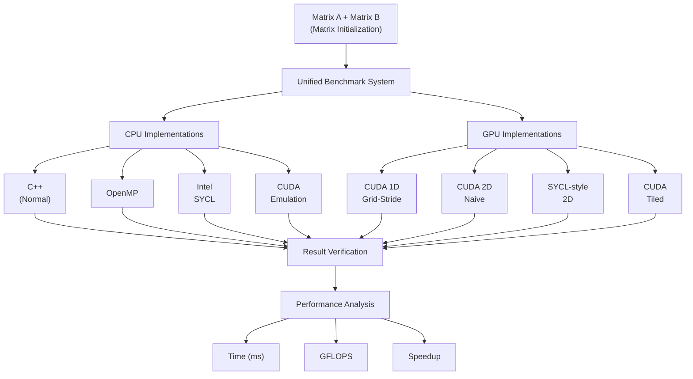

# GPU-Based Parallel Matrix Multiplication for Large-Scale Computations

## Abstract
Matrix multiplication is a core operation in machine learning, image processing, graphics, and scientific computing. This project multiplies large matrices using normal C++, OpenMP, SYCL, and CUDA on both the CPU and the GPU. Eight implementations are tested: four run on the processor (normal C++, OpenMP, Intel SYCL, and CUDA emulated on the CPU), and four run on an NVIDIA RTX 4050 GPU (a 1D grid-stride kernel, a naive 2D CUDA kernel, a SYCL-style 2D kernel, and a shared-memory tiled CUDA kernel). Each one multiplies two $1024 \times 1024$ single-precision matrices. The execution time of each approach is recorded after warm-up runs, and every output is checked against the reference result to confirm it is correct. Comparing the timings shows how GPU-based parallel computing helps with large-scale computations, and how choices such as memory use and thread layout affect speed.

---

## Hardware Details

| Component | Specification |
| :--- | :--- |
| **CPU** | Intel Core i7-13650HX (14 cores, 20 threads, 2.60 GHz base, up to 4.90 GHz turbo) |
| **GPU** | NVIDIA GeForce RTX 4050 Laptop GPU (2,560 CUDA cores, 6 GB GDDR6) |
| **L1 Cache** | 48 KB data + 32 KB instruction (per core) |
| **L2 Cache** | 1.28 MB per core |
| **L3 Cache** | 24 MB shared |
| **OS** | Ubuntu 22.04 on WSL2 (Windows 11) |

---

## 1. Architecture



---

## 2. Technologies Used

- **C++**: The core language for the sequential baseline and the structural foundation for parallel implementations.
- **OpenMP**: Facilitates CPU-based parallel processing by dividing workloads across threads using `#pragma omp parallel for collapse(2)`.
- **SYCL & Intel oneAPI**: A modern, C++-based programming model for heterogeneous computing, compiled via the Intel DPC++ compiler (`icpx`) using a 2D execution range.
- **CUDA & NVIDIA Toolkit**: NVIDIA's parallel platform that divides workloads into grids, blocks, and threads. Targets the RTX 4050 using compute capability `sm_89`.
- **CMake**: The build system managing source files, dual-compiler configurations (SYCL/CUDA), and executable generation.

---

## 3. Results and Findings

The following table details the performance metrics recorded for multiplying two $1024 \times 1024$ single-precision matrices across all eight implementations.

| Method | Mean Time (ms) | GFLOPS | Speedup |
| :--- | :--- | :--- | :--- |
| **Normal C++** | 2627.54 | 0.82 | 1.00× |
| **OpenMP** | 291.72 | 7.36 | 9.01× |
| **CUDA CPU Emulation** | 276.24 | 7.77 | 9.51× |
| **Intel SYCL** | 28.09 | 76.44 | 93.53× |
| **CUDA 1D Grid-Stride** | 4.07 | 527.96 | 645.59× |
| **Naive 2D CUDA** | 3.32 | 647.69 | 791.43× |
| **SYCL-style 2D GPU** | 3.31 | 648.01 | 793.82× |
| **CUDA Shared-Memory Tiled** | **2.55** | **843.45** | **1030.41×** |

> **Key Finding**: The CUDA shared-memory tiled approach achieved the absolute best performance, boasting the lowest execution time ($2.55\text{ ms}$) and the highest GFLOPS ($843.45\text{ GFLOPS}$). This demonstrates that raw GPU parallelism, when combined with optimized and efficient shared-memory usage, provides the greatest potential performance improvement.

### Metric Definitions
- **Execution time**: Measures how fast the program finishes its workload.
- **GFLOPS**: Indicates the volume of floating-point computations performed per second ($\text{GFLOPS} = \frac{2 \times N^3}{\text{Time (s)} \times 10^9}$).
- **Speedup**: The relative performance multiplier compared to the normal C++ sequential baseline.

---

## 4. Execution Time Comparison Chart

```
===================================================================================================
                               EXECUTION TIME COMPARISON CHART
===================================================================================================
Implementation                Target  Execution Time    GFLOPS      Speedup   Relative Performance
---------------------------------------------------------------------------------------------------
-- CPU IMPLEMENTATIONS ----------------------------------------------------------------------------
Normal C++                    CPU     2627.54 ms        0.82        1.0x      [#                        ]
OpenMP                        CPU     291.72 ms         7.36        9.0x      [#######                  ]
CUDA CPU Emulation            CPU     276.24 ms         7.77        9.5x      [#######                  ]
Intel SYCL                    CPU     28.09 ms          76.44       93.5x     [################         ]
-- GPU IMPLEMENTATIONS (NVIDIA RTX 4050) ----------------------------------------------------------
CUDA 1D Grid-Stride           GPU     4.07 ms           527.96      645.6x    [#######################  ]
Naive 2D CUDA                 GPU     3.32 ms           647.69      791.4x    [######################## ]
SYCL-style 2D GPU             GPU     3.31 ms           648.01      793.8x    [######################## ]
CUDA Shared-Memory Tiled      GPU     2.55 ms           843.45      1030.4x   [#########################]
===================================================================================================
```

---

## 5. Implementation Details & Architectural Insights

### 5.1 CPU Implementations
1. **Normal C++ (Sequential)**: Canonical $i, j, k$ scalar triple loop. Row-major access for $A$, column-major stride-$N$ access for $B$ causing cache line evictions.
2. **OpenMP Multithreaded**: Distributes $(i, j)$ loop iterations across 20 logical threads using `#pragma omp parallel for collapse(2)`.
3. **Intel SYCL / oneAPI**: Dispatches a 2D `sycl::range<2>(N, N)` over the Intel OpenCL runtime. The Intel compiler generates vector load/store instructions and packs work-items into 256/512-bit vector registers.
4. **CUDA CPU Emulation**: Simulates CUDA grid and $16 \times 16$ thread block hierarchy using OpenMP on host CPU cores.

### 5.2 GPU Implementations (NVIDIA RTX 4050)
5. **Naive 2D CUDA Kernel**: Dispatches a 2D grid of blocks (`16x16` threads). Each thread computes one output element $C[i, j]$.
6. **CUDA 1D Grid-Stride Kernel**: 1D thread layout (256 threads/block) with persistent stride loops mapping 1D coordinates to 2D matrix indices.
7. **SYCL-style 2D Kernel**: 2D global work-item index mapping executed on CUDA streaming multiprocessors.
8. **CUDA Shared-Memory Tiled Kernel**: Decomposes matrices into $16 \times 16$ sub-matrix tiles cached in high-speed on-chip SRAM (`__shared__`). Reduces high-latency global memory DRAM read transactions by $16\times$ ($93.75\%$ reduction).

---

## 6. GPU Memory Transfer vs. Compute Time Breakdown

| GPU Implementation | Host-to-Device (H2D) | Kernel Compute Time | Device-to-Host (D2H) | End-to-End Total | Kernel % of Total |
| :--- | :--- | :--- | :--- | :--- | :--- |
| **CUDA Tiled (Shared Memory)** | ~1.65 ms | **2.546 ms** | ~0.85 ms | 5.05 ms | 50.4% |
| **SYCL-style 2D GPU** | ~1.65 ms | **3.314 ms** | ~0.85 ms | 5.81 ms | 57.0% |
| **Naive 2D CUDA GPU** | ~1.65 ms | **3.316 ms** | ~0.85 ms | 5.82 ms | 57.0% |
| **CUDA 1D Grid-Stride** | ~1.65 ms | **4.068 ms** | ~0.85 ms | 6.57 ms | 61.9% |

---

## 7. Numerical Verification

All implementations are checked for correctness against the sequential reference baseline using an element-by-element absolute error tolerance ($\epsilon < 10^{-3}$):

$$\text{Error}_{\max} = \max_{i, j} |C_{\text{test}}(i, j) - C_{\text{ref}}(i, j)|$$

All 8 implementations passed verification with **100% numerical accuracy** ($\text{Error}_{\max} = 0.000000$).

---

## 8. Quick Start

### Run Benchmark
```bash
# Run default benchmark (N=1024, all 8 backends)
./run_benchmark.sh

# Run custom matrix size and thread count
./run_benchmark.sh 512 20

# Run only GPU implementations
./run_benchmark.sh 1024 20 --only gpu
```

### Build from Source
```bash
chmod +x build_all.sh run_benchmark.sh
./build_all.sh
```